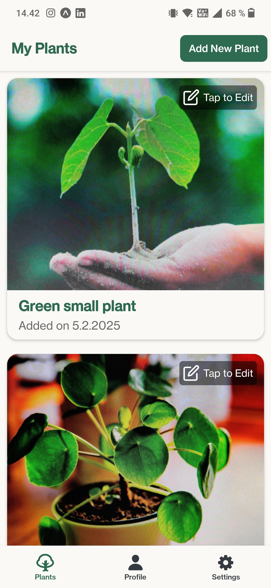

# Plant Photo App 🌱

A mobile application built with React Native that allows users to capture, save and manage photos of plants.

## Features

- 📸 Take photos of plants using device camera
- 📝 Add a name and notes to your plant
- 📱 View all your plants in a scrollable list
- ✏️ Edit plant details including photos
- 🗂️ Organized navigation with bottom tabs

## Table of Contents

- [Installation](#installation)
- [Usage](#usage)
- [Screenshots](#screenshots)
- [Technologies Used](#technologies-used)

## Installation

### Steps

1. Clone the repository:
   ```bash
   git clone https://github.com/pr0fix/plant-photo-app
   ```
2. Navigate to the project directory:
   ```bash
   cd plant-photo-app
   ```
3. Install dependencies:
   ```bash
   npm install
   ```
4. Start the development server:
   ```bash
   npm start
   ```

### Important Notes

- If you are using a mobile device with Expo, make sure you are connected to the same network as your development device.
- If `npm start` doesn't work, try running:
  ```bash
  npm start --tunnel
  ```

## Usage

Once the development server is running, you can scan the QR code displayed in the terminal or Expo Dev Tools to launch the app on your mobile device. Alternatively you can use an iOS simulator or Android emulator to launch the app.

## Architecture

The app follows a component-based architecture with:

**Navigation**

- Bottom tab navigation using @react-navigation/bottom-tabs
- Stack navigation for main features using @react-navigation/stack

**State Management**

- Global state managed with Zustand

**Components**

- **_ListView_**: Main screen showing a list of all saved plants
- **_ListItem_**: Card component used in list view
- **_ScanView_**: Camera interface and photo capture
- **_PhotoPreview_**: Preview captured photo allowing to retake photo
- **_PlantDetailsForm_**: Form for adding the captured plant's name and additional notes
- **_Profile_**: Placeholder component for profile page
- **_Settings_**: Placeholder component for settings page

### Reasoning behind the technological decisions

1. **React Native + Expo**

- Quick development
- Access to native features like camera
- Cross-platform compatibility

2. **Zustand for State Management**

- Small, fast and scalable alternative to Redux
- Simple API with hooks
- Built-in TypeScript support

3. **TypeScript**

- Type safety and better developer experience
- Improved code maintainability

## Screenshots

#### List View



#### Scan View


#### Photo Preview & Add Details View


#### Plant Detail/Edit View


#### Profile & Settings

